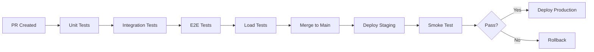

# E2E Test Matrix

**Purpose**: Comprehensive end-to-end test coverage for Magnus Flipper AI platform
**Scope**: Web → API → Workers → Database
**Execution**: CI/CD via GitHub Actions (no manual steps)

---

## Test Matrix Overview

| Layer | Component | Test Type | Automation | Priority |
|-------|-----------|-----------|------------|----------|
| **Web** | Dashboard | UI Flow | Playwright | P0 |
| **API** | REST Endpoints | Integration | Supertest | P0 |
| **Workers** | Scraper Engine | Worker Simulation | Vitest + Mocks | P0 |
| **Mobile** | App Build | Build + Startup | Expo CLI | P1 |
| **Smoke** | Production Health | Deployment Validation | curl + gh CLI | P0 |

---

## 1. Web Layer (Dashboard)

### Test Scenarios

| Scenario ID | Description | Steps | Expected Outcome | Fixtures Required |
|-------------|-------------|-------|------------------|-------------------|
| **E2E-WEB-001** | User Login Flow | 1. Navigate to `/login`<br>2. Click "Sign in with Google"<br>3. Complete OAuth flow<br>4. Verify dashboard loads | Dashboard shows user profile, quota info | Firebase test user |
| **E2E-WEB-002** | Create Scrape Job | 1. Login<br>2. Navigate to `/monitors/new`<br>3. Fill form (query="iPhone 13", marketplace="Facebook")<br>4. Submit job | Job appears in monitors list with status "queued" | None |
| **E2E-WEB-003** | Monitor Job Status | 1. Create job<br>2. Poll job status every 2s<br>3. Verify status transitions | Status: queued → running → completed | Worker mock response |
| **E2E-WEB-004** | View Deals | 1. Login<br>2. Navigate to `/deals`<br>3. Apply filters (price < $500)<br>4. Verify results | Deals list loads, filters apply | Seed deals in DB |
| **E2E-WEB-005** | Quota Enforcement | 1. Login as free-tier user<br>2. Create 4th monitor (limit: 3)<br>3. Verify rejection | Error: "Monitor limit exceeded" | Free-tier user |
| **E2E-WEB-006** | Stripe Checkout | 1. Login<br>2. Click "Upgrade to Pro"<br>3. Complete Stripe checkout (test mode)<br>4. Verify tier upgrade | User tier = "pro", quota updated | Stripe test card |

### Playwright Configuration

```typescript
// e2e/playwright.config.ts
export default defineConfig({
  testDir: './tests',
  fullyParallel: false, // Sequential for state dependencies
  retries: process.env.CI ? 2 : 0,
  workers: process.env.CI ? 1 : undefined,
  use: {
    baseURL: process.env.WEB_URL || 'http://localhost:5173',
    trace: 'on-first-retry',
    screenshot: 'only-on-failure',
  },
  projects: [
    { name: 'chromium', use: { ...devices['Desktop Chrome'] } },
  ],
})
```

---

## 2. API Layer (REST Endpoints)

### Test Scenarios

| Scenario ID | Endpoint | Method | Description | Assertions | Fixtures Required |
|-------------|----------|--------|-------------|------------|-------------------|
| **E2E-API-001** | `/api/health` | GET | Health check | Status 200, `{ status: 'ok' }` | None |
| **E2E-API-002** | `/api/health/ready` | GET | Readiness check | Status 200, DB + Redis ok | PostgreSQL + Redis |
| **E2E-API-003** | `/api/auth/me` | GET | Get current user | Status 200, user object | Firebase token |
| **E2E-API-004** | `/api/monitors` | POST | Create monitor | Status 201, monitor ID returned | Auth token |
| **E2E-API-005** | `/api/monitors/:id` | GET | Get monitor details | Status 200, monitor object | Seed monitor |
| **E2E-API-006** | `/api/monitors/:id` | DELETE | Delete monitor | Status 204 | Seed monitor |
| **E2E-API-007** | `/api/deals` | GET | List deals | Status 200, array of deals | Seed deals |
| **E2E-API-008** | `/api/deals` | GET | List deals (over quota) | Status 429, quota error | Free-tier user at limit |
| **E2E-API-009** | `/api/stripe/checkout` | POST | Create checkout session | Status 200, Stripe session URL | Stripe test mode |
| **E2E-API-010** | `/api/stripe/webhook` | POST | Handle webhook event | Status 200, subscription updated | Stripe webhook event |
| **E2E-API-011** | `/api/admin/controls/kill-switches` | GET | Get kill-switch status | Status 200, config object | Admin token |
| **E2E-API-012** | `/api/admin/controls/kill-switches` | PATCH | Update kill-switch | Status 200, config updated | Admin token |

### Supertest Example

```typescript
// api/tests/integration/e2e.api.test.ts
import request from 'supertest';
import { app } from '../../src/app';

describe('E2E API Layer', () => {
  it('E2E-API-001: Health check', async () => {
    const res = await request(app).get('/api/health');
    expect(res.status).toBe(200);
    expect(res.body).toEqual({ status: 'ok', version: expect.any(String) });
  });

  it('E2E-API-004: Create monitor', async () => {
    const token = await getTestUserToken();
    const res = await request(app)
      .post('/api/monitors')
      .set('Authorization', `Bearer ${token}`)
      .send({
        query: 'iPhone 13',
        marketplace: 'facebook',
        maxPrice: 500,
        refreshInterval: '12h',
      });
    expect(res.status).toBe(201);
    expect(res.body.id).toBeDefined();
  });
});
```

---

## 3. Worker Layer (Scraper Engine)

### Test Scenarios

| Scenario ID | Worker Type | Description | Assertions | Mocks Required |
|-------------|-------------|-------------|------------|----------------|
| **E2E-WORK-001** | Demo Worker | Execute demo scrape | Status: success, 10 deals returned | Apify mock response |
| **E2E-WORK-002** | Facebook Worker | Facebook Marketplace scrape | Status: success, deals parsed | Apify Facebook actor |
| **E2E-WORK-003** | Vinted Worker | Vinted scrape | Status: success, deals parsed | Apify Vinted actor |
| **E2E-WORK-004** | Kill-Switch (Global) | Trigger with scrapers disabled | Status: 503, "Scrapers disabled" | Kill-switch DB config |
| **E2E-WORK-005** | Kill-Switch (Marketplace) | Trigger with Facebook disabled | Status: 503, "Facebook disabled" | Kill-switch DB config |
| **E2E-WORK-006** | Apify Actor Timeout | Simulate actor timeout | Status: error, timeout message | Apify timeout mock |
| **E2E-WORK-007** | Apify Empty Results | Simulate no results | Status: success, 0 deals | Apify empty dataset |
| **E2E-WORK-008** | Concurrency Limit | Submit 5 concurrent jobs (limit: 3) | 3 running, 2 queued | DB seed |

### Worker Simulation (Thin E2E)

Instead of spinning up actual Playwright browsers, use **API call mocking** for workers:

```typescript
// workers/tests/integration/e2e.worker.test.ts
import { vi } from 'vitest';
import { runApifyActor } from '../../src/lib/apify';
import { executeScrapeJob } from '../../src/services/scraper.service';
import { apifyFacebookMock } from '../fixtures/apify.mocks';

describe('E2E Worker Layer', () => {
  it('E2E-WORK-001: Demo scrape', async () => {
    vi.spyOn(apifyClient, 'run').mockResolvedValue(apifyFacebookMock);

    const result = await executeScrapeJob({
      jobId: 'test-job-123',
      marketplace: 'facebook',
      query: 'iPhone 13',
      maxPrice: 500,
    });

    expect(result.status).toBe('success');
    expect(result.deals.length).toBe(10);
    expect(result.deals[0]).toMatchObject({
      title: expect.any(String),
      price: expect.any(Number),
      url: expect.any(String),
    });
  });

  it('E2E-WORK-004: Kill-switch (global)', async () => {
    await setKillSwitch({ scrapersEnabled: false });

    await expect(executeScrapeJob({ jobId: 'test' })).rejects.toThrow(
      'Scrapers disabled'
    );
  });
});
```

---

## 4. Mobile Layer (React Native)

### Test Scenarios

| Scenario ID | Description | Steps | Expected Outcome |
|-------------|-------------|-------|------------------|
| **E2E-MOB-001** | Build Android APK | Run `npm run build:android` | APK created in `apps/mobile/android/app/build/outputs/apk` |
| **E2E-MOB-002** | Build iOS Archive | Run `npm run build:ios` | IPA created in `apps/mobile/ios/build` |
| **E2E-MOB-003** | App Startup (Android) | Launch app in emulator | App loads without crash |
| **E2E-MOB-004** | App Startup (iOS) | Launch app in simulator | App loads without crash |

### Detox Configuration (Proposed)

```json
// apps/mobile/.detoxrc.json
{
  "testRunner": "jest",
  "runnerConfig": "e2e/config.json",
  "apps": {
    "ios": {
      "type": "ios.app",
      "binaryPath": "ios/build/Build/Products/Release-iphonesimulator/MagnusFlipper.app"
    },
    "android": {
      "type": "android.apk",
      "binaryPath": "android/app/build/outputs/apk/release/app-release.apk"
    }
  },
  "devices": {
    "simulator": {
      "type": "ios.simulator",
      "device": { "type": "iPhone 15" }
    },
    "emulator": {
      "type": "android.emulator",
      "device": { "avdName": "Pixel_7_API_33" }
    }
  }
}
```

---

## 5. Production Smoke Test

### Test Scenario

**Objective**: Validate staging deployment before production promotion

| Step | Action | Command | Expected Outcome |
|------|--------|---------|------------------|
| 1 | Deploy staging revision | `gcloud run deploy api --region us-central1 --tag staging` | Deployment succeeds |
| 2 | Health check | `curl https://api-staging.magnusflipper.com/api/health` | Status 200 |
| 3 | Readiness check | `curl https://api-staging.magnusflipper.com/api/health/ready` | Status 200, DB + Redis ok |
| 4 | Create demo scrape job | `curl -X POST /api/monitors/demo` | Job ID returned |
| 5 | Poll job status | `curl /api/monitors/:id` (every 5s, max 60s) | Status transitions to "completed" |
| 6 | Verify deals returned | `curl /api/deals?jobId=:id` | At least 1 deal returned |
| 7 | Test kill-switch (enable) | `curl -X PATCH /api/admin/controls/kill-switches -d '{"scrapersEnabled":false}'` | Config updated |
| 8 | Test kill-switch (enforce) | `curl -X POST /api/monitors` | Status 503, "Scrapers disabled" |
| 9 | Test kill-switch (disable) | `curl -X PATCH /api/admin/controls/kill-switches -d '{"scrapersEnabled":true}'` | Config restored |
| 10 | Cleanup test data | `curl -X DELETE /api/monitors/:id` | Monitor deleted |

### GitHub Actions Workflow

```yaml
# .github/workflows/smoke-test.yml
name: Production Smoke Test

on:
  workflow_dispatch:
    inputs:
      environment:
        description: 'Environment to test'
        required: true
        default: 'staging'
        type: choice
        options:
          - staging
          - production

jobs:
  smoke-test:
    runs-on: ubuntu-latest
    env:
      API_URL: ${{ inputs.environment == 'staging' && 'https://api-staging.magnusflipper.com' || 'https://api.magnusflipper.com' }}
      ADMIN_TOKEN: ${{ secrets.ADMIN_TOKEN }}

    steps:
      - name: Health Check
        run: |
          response=$(curl -s -w "%{http_code}" -o /dev/null $API_URL/api/health)
          if [ "$response" != "200" ]; then
            echo "Health check failed: $response"
            exit 1
          fi
          echo "✅ Health check passed"

      - name: Readiness Check
        run: |
          response=$(curl -s $API_URL/api/health/ready)
          status=$(echo $response | jq -r '.status')
          if [ "$status" != "ready" ]; then
            echo "Readiness check failed: $response"
            exit 1
          fi
          echo "✅ Readiness check passed"

      - name: Create Demo Scrape Job
        id: create-job
        run: |
          response=$(curl -s -X POST $API_URL/api/monitors/demo \
            -H "Authorization: Bearer $ADMIN_TOKEN")
          job_id=$(echo $response | jq -r '.id')
          echo "job_id=$job_id" >> $GITHUB_OUTPUT
          echo "✅ Demo job created: $job_id"

      - name: Poll Job Status
        run: |
          job_id="${{ steps.create-job.outputs.job_id }}"
          max_attempts=12
          attempt=0

          while [ $attempt -lt $max_attempts ]; do
            response=$(curl -s $API_URL/api/monitors/$job_id)
            status=$(echo $response | jq -r '.status')

            echo "Attempt $attempt: Job status = $status"

            if [ "$status" == "completed" ]; then
              echo "✅ Job completed successfully"
              exit 0
            fi

            if [ "$status" == "failed" ]; then
              echo "❌ Job failed"
              exit 1
            fi

            sleep 5
            attempt=$((attempt + 1))
          done

          echo "❌ Job did not complete within 60 seconds"
          exit 1

      - name: Verify Deals Returned
        run: |
          job_id="${{ steps.create-job.outputs.job_id }}"
          response=$(curl -s "$API_URL/api/deals?jobId=$job_id")
          deal_count=$(echo $response | jq '. | length')

          if [ "$deal_count" -lt 1 ]; then
            echo "❌ No deals returned"
            exit 1
          fi
          echo "✅ $deal_count deals returned"

      - name: Test Kill-Switch (Enable)
        run: |
          curl -s -X PATCH $API_URL/api/admin/controls/kill-switches \
            -H "Authorization: Bearer $ADMIN_TOKEN" \
            -H "Content-Type: application/json" \
            -d '{"scrapersEnabled":false}'
          echo "✅ Kill-switch enabled"

      - name: Test Kill-Switch (Enforce)
        run: |
          response=$(curl -s -w "%{http_code}" -o /dev/null \
            -X POST $API_URL/api/monitors/demo \
            -H "Authorization: Bearer $ADMIN_TOKEN")

          if [ "$response" != "503" ]; then
            echo "❌ Kill-switch not enforced (expected 503, got $response)"
            exit 1
          fi
          echo "✅ Kill-switch enforced"

      - name: Test Kill-Switch (Disable)
        run: |
          curl -s -X PATCH $API_URL/api/admin/controls/kill-switches \
            -H "Authorization: Bearer $ADMIN_TOKEN" \
            -H "Content-Type: application/json" \
            -d '{"scrapersEnabled":true}'
          echo "✅ Kill-switch disabled"

      - name: Cleanup Test Data
        if: always()
        run: |
          job_id="${{ steps.create-job.outputs.job_id }}"
          curl -s -X DELETE $API_URL/api/monitors/$job_id \
            -H "Authorization: Bearer $ADMIN_TOKEN"
          echo "✅ Test data cleaned up"
```

---

## Test Data Requirements

### Seed Data

| Entity | Count | Purpose |
|--------|-------|---------|
| Test Users | 3 | Free, Pro, Enterprise tiers |
| Monitors | 10 | Various marketplaces, statuses |
| Deals | 100 | Price range $10-$1000 |
| Kill-Switch Config | 1 | Default: all enabled |

### Fixtures

1. **Apify Responses** → `e2e/fixtures/apify/`
2. **Stripe Events** → `e2e/fixtures/stripe/`
3. **Firebase Test Users** → `e2e/fixtures/firebase/`

---

## CI/CD Integration

### Workflow Sequence



### Test Parallelization

| Stage | Duration | Parallelization |
|-------|----------|-----------------|
| Unit Tests | ~30s | Full (all packages) |
| Integration Tests | ~2m | Sequential (DB dependency) |
| E2E Tests | ~5m | Sequential (state dependency) |
| Load Tests | ~3m | Sequential (resource limit) |
| Smoke Test | ~2m | Sequential (deployment validation) |

**Total CI/CD Runtime**: ~12 minutes

---

## Coverage Goals

| Layer | Current | Target | Gap |
|-------|---------|--------|-----|
| Unit | 65% | 80% | +15% |
| Integration | 45% | 70% | +25% |
| E2E | 30% | 60% | +30% |
| Load | Baseline only | Peak + Stress | +2 scenarios |

---

## Success Criteria

- ✅ All E2E tests pass in CI/CD
- ✅ No manual intervention required
- ✅ Smoke test validates staging deployment
- ✅ Kill-switch tested in every workflow
- ✅ Mobile builds succeed
- ✅ Test execution time < 15 minutes
- ✅ Zero false positives (flaky tests)

---

## Next Steps

1. Implement missing fixtures (Apify, Stripe)
2. Extend Playwright scenarios (E2E-WEB-003 to E2E-WEB-006)
3. Create mobile build workflow
4. Integrate smoke test into deployment pipeline
5. Add observability (test result dashboards)
